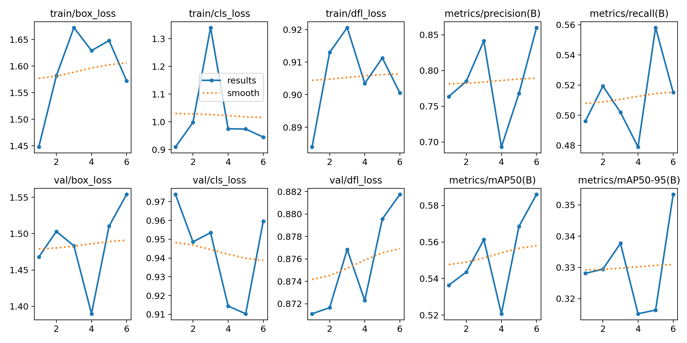
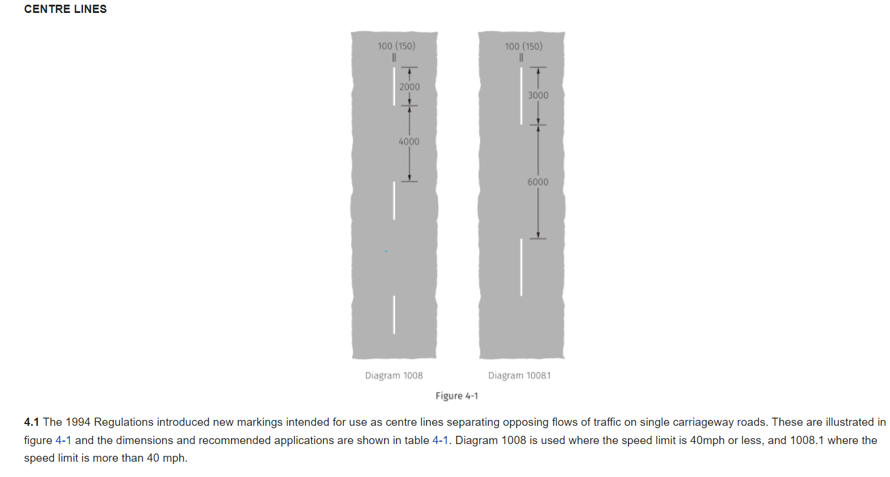
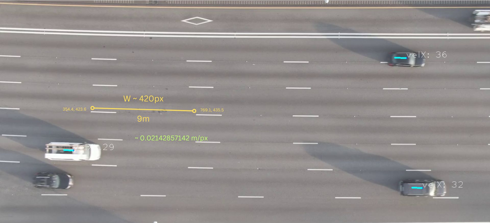

# Aerial-Cars

https://github.com/project-slot/Aerial-Cars/assets/99946449/885b4b8b-3095-4298-84ef-bdb0cc59bd96

https://github.com/project-slot/Aerial-Cars/assets/99946449/fd564dcb-2909-4dec-8388-2af41a09bf81

## Initial app

roach

## Training

- As I have a relatively low-end computer, I only used `yolov8n`, which means there is wide room for improvement if I use a more powerful one, such as `yolov8l` or `yolov8x`.
- 28 epoch - 1.3 hours -
- 367 images - 416x416
- dataset details can be found [here](https://github.com/TungVietLe/Aerial-Cars/blob/main/README.roboflow.txt)

- What I observed in the last few epochs is that the mAP50 and mAP50-95 barely improve. I ran a few more epoch after with (patience=4) and it stops prematurely, which means the model stops improving. However, at the same time, the `patience` value is really low to draw any meaningful conclusion.

_last training result._

## Calculations

- **The idea is fairly simple:** since the camera is positioned top-down, if we know the pixel distance a car move in the frame, we can translate it into real-world measurements.
- I use the following source:

- Based on these, we can see that: `speedX = distanceX * meter_per_pixel * fps` (each frame)

- To get the distance, simply store the `id` of each car in a dictionary, then compare and update it every frame (or any duration of time).
