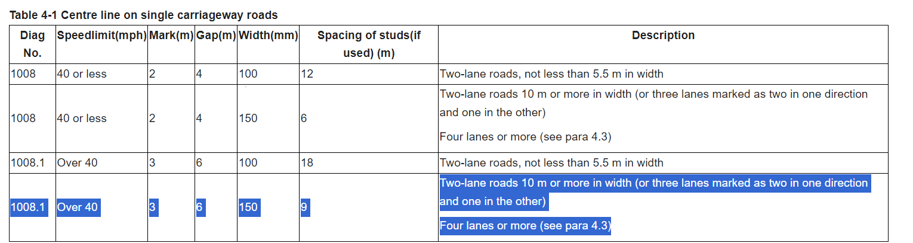
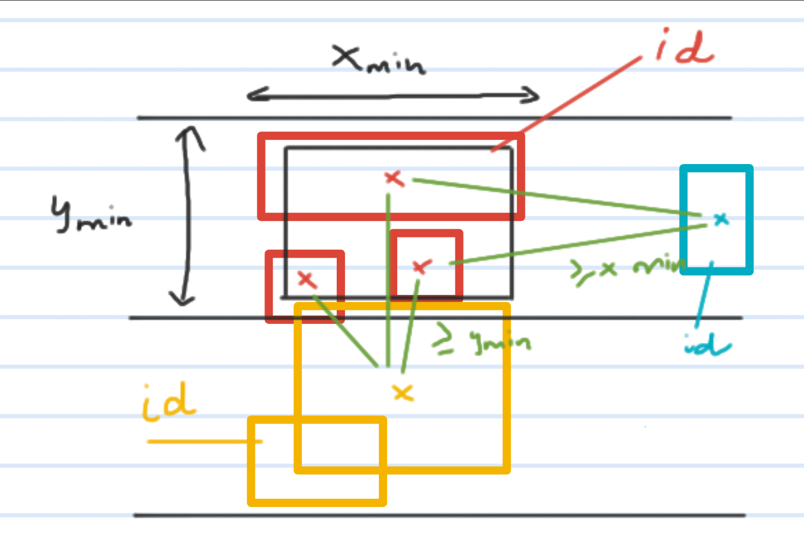
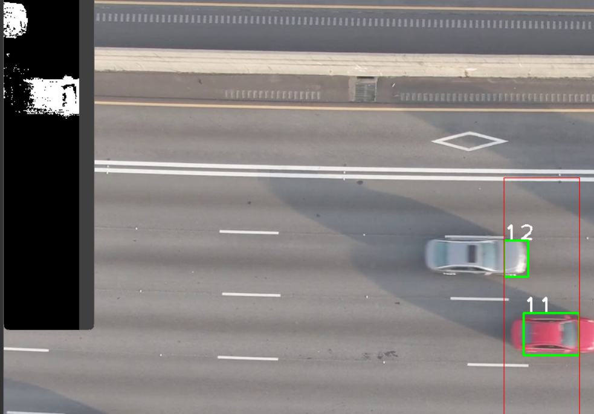

# Aerial-Cars

Object dection and speed estimation.

## Training

- As I have a relatively low-end computer, I only used `yolov8n`, which means there is wide room for improvement if I use a more powerful one, such as `yolov8l` or `yolov8x`.
- 28 epoch - 1.3 hours
- 367 images - 416x416
- dataset details can be found [here](https://github.com/TungVietLe/Aerial-Cars/blob/main/README.roboflow.txt)

- What I observed in the last few epochs is that the mAP50 and mAP50-95 barely improve. I ran a few more epoch after with (patience=4) and it stops prematurely, which means the model stops improving. However, at the same time, the `patience` value is really low to draw any meaningful conclusion.

_latest training result (yolov8n)._

_the model trained mostly on "far view" dataset, such that I tried to use it on this video_

## Calculations

- **The idea is fairly simple:** since the camera is positioned top-down, if we know the pixel distance a car move in the frame, we can translate it into real-world measurements.
- I use the following source:

- Based on these, we can see that: `speedX = distanceX * meter_per_pixel * fps` (each frame)

- To get the distance, simply store the `id` of each car in a dictionary, then compare and update it every frame (or any duration of time).

## Initial approach (motion detection)

My initial approach is to use Motion detection + Custom tracking based on distance, but later I decided to use `yolov8` for expansion potential and learning purposes.

_initial idea of tracking + assigning id in ROI (region of interest)_

_results of the initial 'motion detection' approach_
